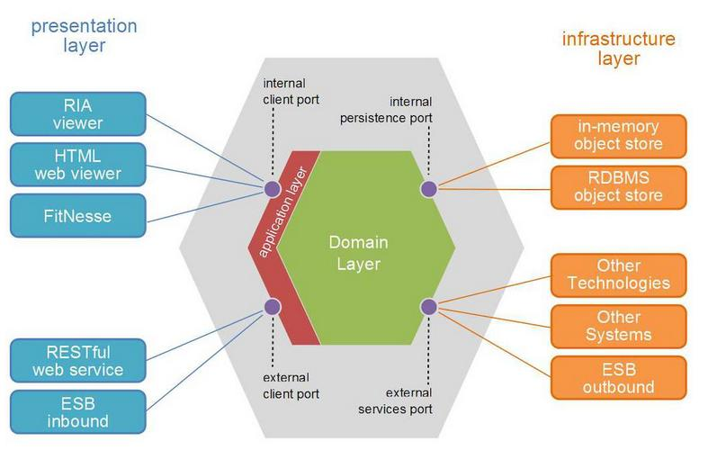

# TP MIAGE conception logicielle

NOTE: TP de deux slots de 1h20

## Nom des étudiants de ce binôme 
WARNING: NE PAS OUBLIER DE MENTIONNER LES DEUX NOMS !

Dorian FAURE et Alexis PETIT

Commentaires éventuels des étudiants : -

## Pré-requis 

WARNING: A faire impérativement *AVANT* le TP, nous n'aurons pas le temps pendant !

* disposer d'au moins un compte Github par binôme ;
* apporter au moins un portable Linux, MacOS ou Microsoft Windows par binôme ;
* un JDK 8+  (conseillé : OpenJdk. Sous linux, installer le paquet `openjdk-13-jdk` par exemple) ;
* Eclipse 2019+ (ou un autre IDE Java) installé ;
* Un client PostgreSQSL (conseillé : plugin Eclipse `DBeaver IDE`) ;
* un démon Docker récent 2018+ ;
* disposer d'une image Docker Postgresql en local, faire `docker pull postgres` ;
* un client REST (conseillés : https://insomnia.rest/[Insomnia] ou https://www.postman.com/[Postman]) ;
* forker sur Github le projet `bflorat/tp1-miage-2020` puis cloner votre dépôt Github dans votre workspace. Attention : *un seul fork par binôme*  ;
* Pour les étudiants désirant utiliser la connexion de l'université, il faudra configurer le proxy de l'université dans les différents outils (Docker, Git, Eclipse) *avant le TP*.

# Déroulement du TP

NOTE: Il est vivement conseillé d'utiliser votre connexion Internet personnelle, pas le wifi de l'université (pour lequel il faut configurer le proxy HTTP). Les élèves désirant utiliser la connexion de l'université devront configurer le proxy dans les différents outils eux mêmes et avant le TP. 

NOTE: [Rappel sur Git] Trois dépôts sont ici utilisés: le dépot Github de l'enseignant (`bflorat/tp1-miage-2020`), le dépot Github du binôme (`etudiant_x/tp1-miage-2020`), le dépot local sur le portable de l'un ou des deux étudiants du binôme.

NOTE: Pour importer un projet maven existant dans Eclipse, faire `File` -> `Import` -> `Import existing Maven project` et cocher le(s) projet(s) à importer.


Veuillez *répondre aux questions de la feuille de TP juste sous la question* (en modifiant, commitant puis poussant le fichier `README.adoc`).

Nous fournissons différents projets Eclipse servant de base de travail aux exercices suivant. Cela permet un point de synchronisation de tous les étudiants à différents moments du TP. 

TIP: fermez chaque projet Eclipse (sans supprimer les sources) avant de passer à l'exercice suivant pour éviter de confondre les sources.


# Exercice 1 - Etudier une API REST sans couches
_Temps estimé : 1 h_

* Importer dans Eclipse les projets `todolist-debut-ex1` et `todolist-debut-ex2`.

* Observer le code du projet `todolist-debut-ex1`

*Le code est-il structuré en couches ? Imaginez un projet d'entreprise constitué de centaines de classes ainsi structuré : que risque-t-il d'arriver ?*

On constate que toutes les classes sont dans le même répertoire ce qui constitue un problèmes de séparation des responsabilités. 
Sur un projet avec des centaines de classes il serait très difficile de s’y retrouver dans le code. 
Une proposition d'arborescence respectant respectant l’architecture en couche serait : 

* persistence
  ** TodoItemRepository.java
* domain
  ** TodoItem.java
* configuration
  ** TodoListApplication.java
* controller
  ** TodoListController


*Où se trouve le code métier (voir la règle de gestion RG1) ? Cette règle est-elle facilement testable par un test unitaire ?*

  Le code métier se trouve dans la classe TodoListController.java. Il est implémenté par les méthodes todoItems() et finalContent(). Pour chaque TodoItem de la liste retournée par le repository, on vérifie si ce dernier date de plus de 24h. Si oui, alors on lui ajoute la note [LATE!].

  Cette règle n'est pas facilement testable car elle nécessite de mocker les services et repository. 

  Voici un exemple de test unitaire utilisant mockito: 

```java
@Mock
private TodoRepository todoRepository;

private TodoListController todoListController = new TodoListController(todoRepository);


@Test
public void should_get_all_todoItems_from_database() {
    
LocalDate date = LocalDate.parse("2000-12-31");
Instant late = date.atStartOfDay(ZoneId.of("Europe/Paris")).toInstant();
Instant notLate = Instant.now()
TodoItem firstTodo = new TodoItem("1", late, ’faire le tp1’);
TodoItem secondTodo = new TodoItem("2" , notLate, ’faire le tp2’);
    
//Given
given(todoRepository.findAll()).willReturn(asList(firstTodo, secondTodo));

//When
List<TodoItem> allTodos = todoListController.todoItems();


//Then
assertThat(allTodos).get(0).getContent.contains(´[LATE!]´);
assertThat(allTodos).get(1).getContent.containsNot(´[LATE!]´);
}
}
```

* Lancer une base PostgreSQL en Docker :
```bash
docker run --rm -it -e POSTGRES_PASSWORD=password -p 5432:5432 postgres
```
*Expliquer cette ligne de commande (y compris les options utilisées)*

  Cette commande permet de lancer un conteneur contenant une base de données en l’exposant sur le port 5432 : 

* docker run : démarre le conteneur
* --rm : supprime automatiquement le conteneur à la fin de l’exécution ; 
* -i : affiche les logs du conteneur (mode interactif) ;   
* -t : permet d’avoir un pseudo-terminal (pour exécuter des commandes dans le conteneur une fois lancé) ; 
* -e POSTGRES_PASSWORD=password : initialise la variable d’environnement POSTGRES_PASSWORD dans le conteneur  ; 
* -p 5432:5432 : redirige le port 5432 du conteneur sur le port 5432 de la machine hôte ; 
postgres : nom de l’image du conteneur à démarrer.


*Compléter le code manquant dans la méthode `TodoListController.createTodoItem()`*
```java
@PostMapping("/todos")
@ResponseStatus(code = HttpStatus.CREATED)
public void createTodoItem(@RequestBody TodoItem todoItem) {
	this.todoItemRepository.save(todoItem);
}
```

*Pourquoi `todoItemRepository` est-il `null` ? Quelle est la meilleure façon de l'injecter ?*

  todoItemRepository n’est pas injecté, c’est pourquoi nous obtenons une ‘nullPointerException’. Pour l’injecter par le constructeur qui est la meilleur manière de faire, il faut ajouté l’annotation ‘@Inject’ au constructeur.

* Modifier le code en conséquence.

* Tester vos endpoints avec un client REST.

  Nos requêtes de test Insomnia se trouvent à la racine du projet de l’exercice1.

  *   createTodoItem : 
Requête : POST => localhost:8080/todos
```json
{
    "id": "2",
    "content": "hello",
    "time": 1547111250
}
```
 Réponse : 201

Requête todoItems : 
Requête : GET => localhost:8080/todos

  Réponse : 
```json
[
  {
	"id": "1",
	"time": "2017-08-14T12:17:47.720Z",
	"content": "[LATE!]hello"
  },
  {
	"id": "2",
	"time": "2020-03-10T09:07:30Z",
	"content": "hello"
  },
  {
	"id": "3",
	"time": "2019-01-10T09:07:30Z",
	"content": "[LATE!]hello"
  }
]
```


[NOTE]
====
* les endpoints sont donnés dans le contrôleur via les annotation `@XYZMapping` 
* Exemple de contenu JSON : 

```json
{
    "id": "0f8-06eb17ba8d34",
    "time": "2020-02-27T10:31:43Z",
    "content": "Faire les courses"
  }
```
====

* Quand les deux endpoints fonctionnent, faire un push vers Github et fermer le projet Eclipse (ne pas le supprimer).

# Exercice 2 - Refactoring en architecture hexagonale
_Temps estimé : 1 h_

* Partir du projet `todolist-debut-ex2`


NOTE: le projet a été réusiné suivant les principes de l'architecture hexagonale : 


Source : http://leanpub.com/get-your-hands-dirty-on-clean-architecture[Tom Hombergs]

* Ici, comme souvent, le domaine métier est découpés en deux couches : 
  - la couche application qui contient tous les contrats : ports (interfaces) et les implémentations des ports d'entrée (ou "use case") et qui servent à orchestrer les entités.
  - la couche entités qui contient les entités (au sens DDD, pas au sens JPA). En général, classes complexes (méthodes riches, relations entre les entités,  pas de simples POJO anémiques)

*Rappeler en quelques lignes les grands principes de cette architecture.*

  L’architecture hexagonale place les entrées et les sorties aux extrémitées du système. La logique métier ne dépend pas de l’accès aux données, que ce soit par des micro-services REST, GraphQL, une base de données ou un fichier CSV. 
  La logique métier est isolée des problématiques externes à l’application. 
  Cette séparation induit également une faible dépendance entre le code métier et l’accès aux données, il est donc facile de changer de base de données, ou encore de protocole de communication : faire évoluer une API REST vers une API GraphQL par exemple.
  Les protocoles de test sont eux aussi simplifiés car on peut tester la logique métier sans avoir à mocker différents systèmes d’accès aux données.


Complétez ce code avec une fonctionnalité de création de `TodoItem`  persisté en base et appelé depuis un endpoint REST `POST /todos` qui :

* prend un `TodoItem` au format JSON dans le body (voir exemple de contenu plus haut)
* renvoie un code `201` en cas de succès. 

La fonctionnalité à implémenter est contractualisée par le port d'entrée `AddTodoItem`.

# Exercice 3 - Ecriture de tests
_Temps estimé : 20 mins_

* Rester sur le même code que l'exercice 2

* Implémentez (en junit) des TU sur la règle de gestion qui consiste à afficher `[LATE!]` dans la description d'un item en retard de plus de 24h.

*Quels types de tests devra-t-on écrire pour les adapteurs ?*

 Les types de tests à écrire pour les adapteurs sont les tests d'intégration.

*Que teste-on dans ce cas ?*

  Dans ce cas on vérifie la compatiblité entre les modules.

*S'il vous reste du temps, écrivez quelques uns de ces types de test.*

 Nous avons écrit un test d'intégration pour le controlleur de l'application. Ce dernier simule une requête POST sur le endpoint /todos contenant un TodoItem et est valide si le serveur répond un code 201.
 Nous n'avons pas pu le tester dû à un probléme de configuration Spring. Cependant, nous pensons que ce test est valide. 

[TIP]
=====
- pour tester l'adapter REST, utilisez l'annotation `@WebMvcTest(controllers = TodoListController.class)`
- Voir cette https://spring.io/guides/gs/testing-web/[documentation]
=====